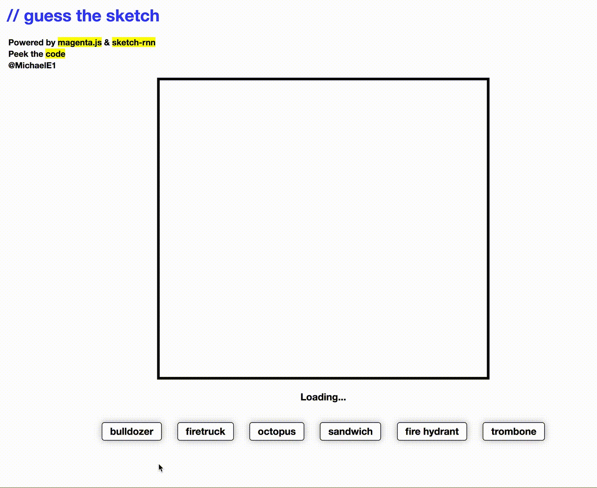

# [guess-the-sketch](https://guess-the-sketch.glitch.me/)

A matching game powered by Magenta's sketch-rnn model :mag:

### Built with

+ [Magenta.js](https://magenta.tensorflow.org/)
+ [Sketch-RNN](https://magenta.tensorflow.org/sketch-rnn-demo)
+ [Glitch](https://glitch.com)

### Run locally

There are no build steps! But, json models do need to be dynamically loaded and for this reason I suggest using a simple http-server. If you like, you can use [browser-sync](https://www.browsersync.io/). I've included it in `package.json`. `npm install` & then `npm start`.